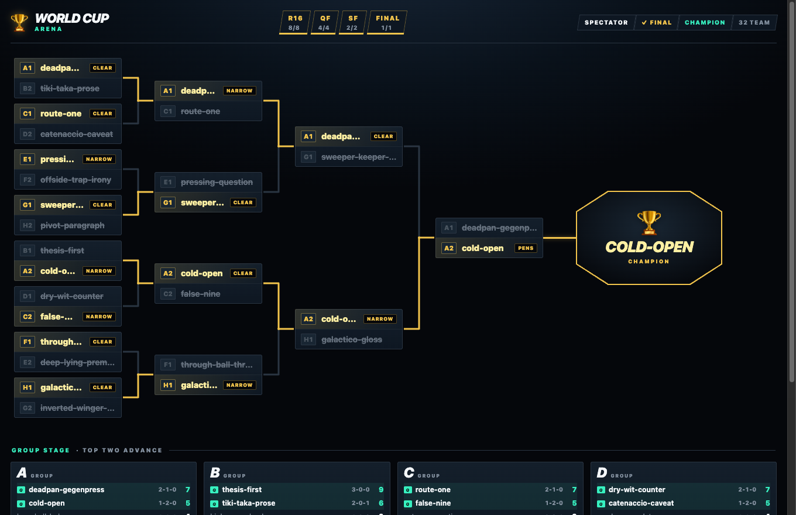
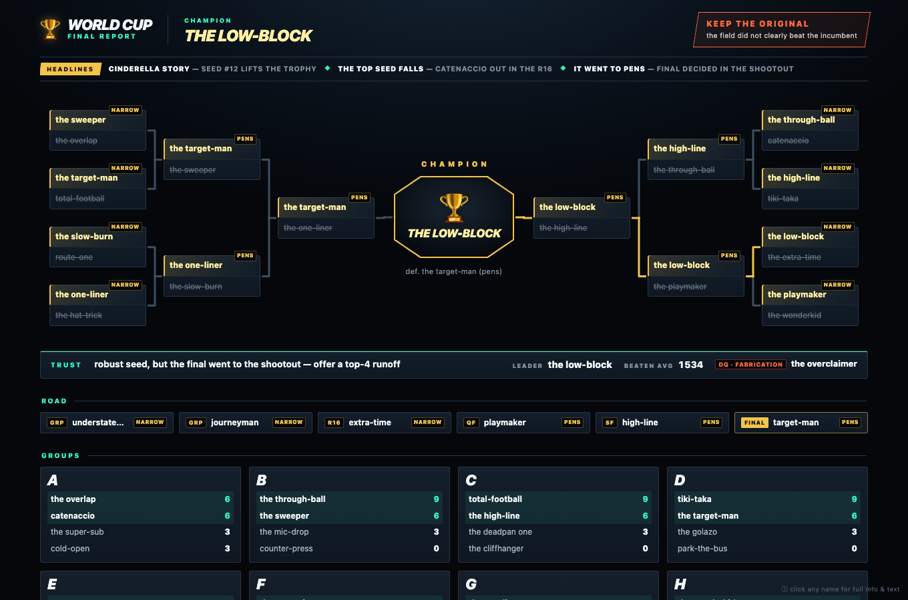
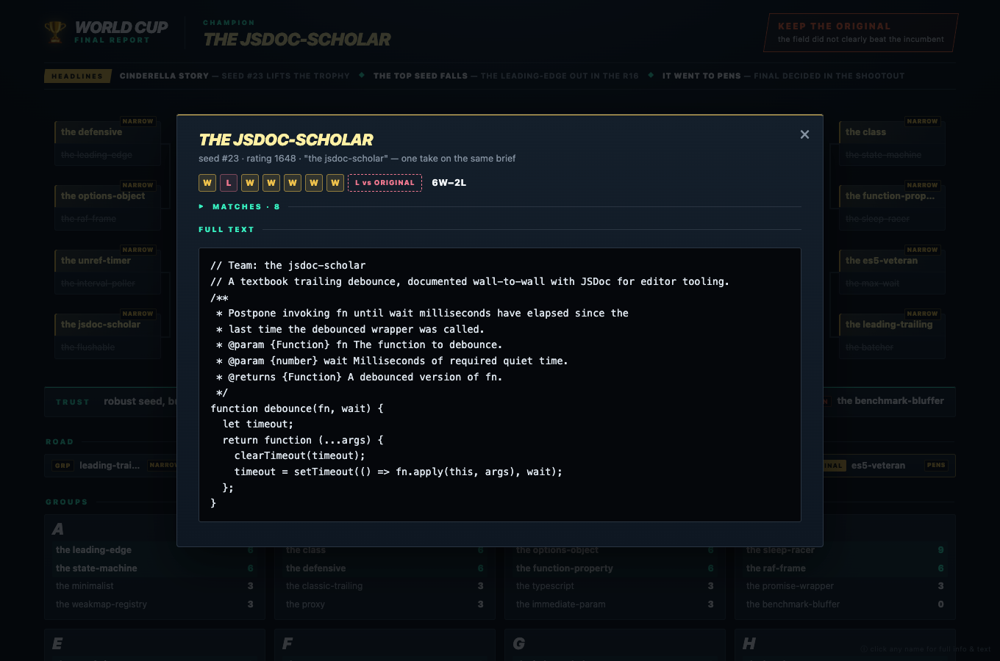
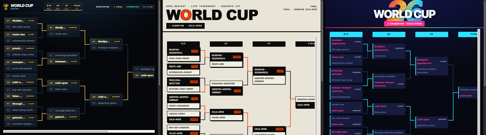

# worldcup

[](https://github.com/pro-vi/worldcup/actions/workflows/ci.yml)
[](LICENSE)
[](package.json)

A general best-of-N selection engine wearing a World Cup-style tournament
bracket, packaged as an agent skill.

Mass-produce many candidates, or bring a field you already have. `worldcup`
stages them through round-robin groups into a single-elimination knockout judged
by taste-calibrated LLM panels, then emits a self-contained HTML report of the
final bracket. The engine is artifact-agnostic: anything text-representable that
a panel can rank by reading — taglines, names, designs, prompts, configs, plans,
code solutions — runs through the same machinery. Full disclosure: prose
(essays, taglines) is where it has real mileage; the non-prose path is exercised
by the test harness and a committed code sample, not yet by battle.

**The judge, in one line:** a vivid fabricated entry forfeits; it does not lose
"some points." Truth and authorial fidelity are gates. Taste begins only after
an entry proves it is not cheating.



`worldcup` is an independent open-source project. It is not affiliated with,
endorsed by, or sponsored by FIFA or any tournament organizer.

## See it in sixty seconds

No agents, no API keys — a bundled demo tournament plays itself through the real
live-view pipeline:

```bash
git clone https://github.com/pro-vi/worldcup.git
cd worldcup
npm run demo
```

Open the URL it prints and watch the group tables build, the knockout fill
slot by slot, and a champion get crowned — including one entry thrown out at the
fabrication gate, because that is the whole point of this engine.

## Why a tournament?

This skill exists because the naive version fails in a specific way. An early
run let an essay win by fabricating concrete detail — invented line numbers, a
fake stack trace — that read as "authentic" to a single tasteless judge. The fix
is not a bigger model. It is a judging architecture with taste: a fact-ledger
fabrication gate that disqualifies liars outright, adversarial lenses that each
attack one axis, an incumbent the champion must beat on merit, panels that scale
with the stakes, and a global pairwise rating over every decided match (Elo
in the shipped template) that calls out a lucky bracket.

The tournament shape is not just theater. It makes selection *legible*: instead
of an opaque "the model liked #17," you get group standings, upsets, a
champion's road with the deciding reasons round by round, and a trust verdict
that says plainly when the bracket and the rating disagree.

## Why not one big judge call?

Fair question, and the honest answer is *we have not measured it.* A single
strong-model call handed the same fact-ledger packet is the obvious cheaper
baseline, and nothing here has beaten it on a benchmark — because there is no
benchmark yet. Per [ADR 0001](docs/adr/0001-single-domain-general-judge.md),
with no eval harness "every alternative judge design is argument, not
measurement"; per
[ADR 0002](docs/adr/0002-no-judge-certification-canary-floor.md), a passing
release canary means "not obviously broken," never "certified."

What the tournament *demonstrably* adds over one opaque score is the legibility
described above — standings, the champion's road, the global rating, the trust
verdict — plus a fabrication veto that is mechanism-validated, not asserted:
each of the release canary's three fabrication cases was disqualified 3-of-3 by
real judges (`canary/records/2026-07-v0.1.0.json`). A head-to-head eval against
the single-call baseline is named future work.

## What a run produces



- **The HTML report** — a self-contained page: mirror bracket, match-day
  headlines, group tables, the champion's road to the title, the global rating,
  disqualifications, and the trust verdict. Every entry is clickable, with its
  full text and match log.
- **The champion** — plus how it won the final, and every opponent it beat.
- **The reference challenge** — the champion must clearly beat the original it
  was varied from, or the recommendation is "keep the original." Confirming the
  field never improved on the real thing is a real result, not a failure.
- **The trust verdict** — a single-elimination winner can be a lucky draw; the
  report says so and offers a runoff.
- **The confetti** — the trophy throws a burst when the report opens; click the
  cup to replay it. Doctrine-aware: a champion that failed the fabrication gate
  gets no party (the verdict says DO NOT TRUST, and the page won't contradict
  it), and the auto-fire respects `prefers-reduced-motion`.

Two committed samples, both reproduced byte-for-byte by
`node scripts/render-sample-report.js` (the whole tournament run with
deterministic stub judges; `npm run check` fails if they drift). GitHub shows
these links as raw HTML source, not a rendered page — clone the repo and open
them in a browser, or regenerate them locally with the command above, to see
the actual report:

- [`docs/media/sample-report.html`](docs/media/sample-report.html) — 32 tagline
  variants, the prose-shaped case.
- [`docs/media/sample-report-code.html`](docs/media/sample-report-code.html) —
  the same machinery on **code**: 32 generated `debounce` implementations, one
  disqualified at the gate for a fabricated benchmark claim. Code entries render
  as code in the report's info sheets.



## Quickstart

### Claude Code

From inside the clone (where the demo left you), link the skill folder into
Claude Code's personal skill directory (`-sfn` makes re-runs safe):

```bash
git clone https://github.com/pro-vi/worldcup.git && cd worldcup   # skip if you ran the demo
mkdir -p ~/.claude/skills
ln -sfn "$(pwd)/worldcup" ~/.claude/skills/worldcup
ls ~/.claude/skills/worldcup/SKILL.md   # verify: should list the file
```

Restart Claude Code so it reloads skill metadata, then ask for `/worldcup` or
describe a task like "generate 32 tagline variants and pick the best."

### Codex CLI

> **On Codex today:** a full tournament run needs Claude Code's ultracode
> Workflow tool, which Codex does not provide. Installing the skill on Codex
> still gets you the self-playing `npm run demo`, the fabrication-gated judging
> doctrine, and the portable Workflow template you can drive from any
> orchestrator — see [Without the Workflow tool](#the-workflow-dependency).

Codex loads skills from `$CODEX_HOME/skills`, defaulting to `~/.codex/skills`.
Same shape, from inside the clone:

```bash
git clone https://github.com/pro-vi/worldcup.git && cd worldcup   # skip if you ran the demo
mkdir -p "${CODEX_HOME:-$HOME/.codex}/skills"
ln -sfn "$(pwd)/worldcup" "${CODEX_HOME:-$HOME/.codex}/skills/worldcup"
ls "${CODEX_HOME:-$HOME/.codex}/skills/worldcup/SKILL.md"   # verify
```

Restart Codex so it reloads skill frontmatter. In a new session, mention
`worldcup` to pull in the judging doctrine and the portable template; run the
full bracket from a Claude Code host (see the note above).

## Requirements

- An agent host that can load skills from `SKILL.md`.
- Node.js 20+ for the demo, the live view, and the repository checks.
- No npm dependencies.

### The Workflow dependency

Real tournament runs need the
**[ultracode Workflow tool](https://code.claude.com/docs/en/workflows)**: a
multi-agent orchestration feature of the agent host (Claude Code's ultracode
mode) that takes a plain-JavaScript script exposing `agent()` / `parallel()` /
`log()` / `phase()` and runs it as one deterministic background run. It needs
Claude Code v2.1.154 or later on a paid plan — enable it with `/effort
ultracode`, or just ask for a workflow in any prompt. The skill fills that
script in from `worldcup/references/workflow-template.js`.

Honest cost note: a real 32-team run is hundreds of judge and generation agent
calls — the skill states the ballpark and the tier before launching (see the
Cost section of `worldcup/SKILL.md`).

Without the Workflow tool, you still get:

- `npm run demo` — the full live-view experience on a bundled fixture;
- `worldcup/references/judging.md` — a standalone, fabrication-gated
  LLM-judging doctrine you can lift into any evaluation setup;
- `worldcup/references/workflow-template.js` — portable plain JS with clearly
  marked fill-in seams, adaptable to any orchestrator that can spawn judge
  agents (the repo's own test harness drives it with stub judges). Porting
  contract: the host's `parallel()` must return results in input positions
  (`Promise.all` semantics) — a pool that returns results in completion order
  silently breaks the byte-identical determinism this repo advertises.

## The live view



Every run is watchable for free in `/workflows` (Tier-0). Tier-1 is a
dependency-free HTML bracket that fills in *while the run happens*: group tables
building, knockout games "playing", winners advancing. Three curated themes —
`arena`, `concrete`, `2026` — plus `--switcher` to flip between them and
`--serve` for a flicker-free page on `127.0.0.1`. When the champion is crowned,
the page throws confetti (click the champion card to replay). Preview any time
with `npm run demo`; wiring into a real run is step 4 of `worldcup/SKILL.md`.

## Verify the repo

```bash
npm run check
```

That runs syntax checks for the executable JavaScript, the live-view parser/fold
tests, the canary-validator tests, a **fake-judge end-to-end harness** that
plays the entire tournament template with deterministic stub judges (including
a completion-order-invariance test: same verdicts, byte-identical report), and
the release-canary fixture contract. CI runs the same on Linux (Node 20/22/24)
and Windows (Node 20).

The six-case judge canary is also run through real judges before each release,
and the validated record is committed: see [`canary/records/`](canary/records/)
for the runs and [`canary/README.md`](canary/README.md) for the rules.

## Layout

- `worldcup/` - the skill itself.
  - `SKILL.md` - triggers, inputs to settle, procedure, judging doctrine, cost tiers.
  - `references/judging.md` - the taste engine: deterministic preflight,
    fabrication gate, diverse-lens panels, calibration, rating, reference
    challenge, and domain profile sockets.
  - `references/brackets.md` - exact 32-team and 48-team bracket math, snake
    seeding, group advancement, and strict-fidelity notes.
  - `references/workflow-template.js` - the ultracode Workflow template the skill
    copies and fills; it encodes seeding, group->knockout, judging, Elo, the
    reference challenge, and the final HTML report.
  - `references/live-view.js` and `live-view.md` - the live view and its event
    contract; also home of the `--demo` mode.
  - `references/profiles/` - optional domain/voice taste you plug into the
    domain-general judge. The engine ships taste-neutral; bring your own profile.
  - `references/coordinates.md`, `references/design-pass.md` - candidate
    generation references for flat, axes, and section/recombination runs.
- `canary/` - the release-canary contract, record shape, and recorded runs.
- `scripts/` - launch checks, the fake-judge harness loader, the sample-report
  generator.
- `tests/` - Node test suites: live-view fold/render, canary validator, and the
  end-to-end tournament harness.
- `docs/adr/` - durable architecture decisions.
- `docs/media/` - screenshots and the committed sample report.

## Status

Shipped: hand-authored flat fields, factorial/axes generation, section
recombination with a coherence judge, snake seeding, group-stage draws, 32-team
and 48-team advancement, best-third surfacing, the fabrication gate, Elo,
reference challenge, live view with demo mode, match-day headlines, and the
final HTML report — plus a fake-judge e2e harness that keeps all of it honest.

Deferred: genetic evolve mode, optimal-design solver for mixed-radix fractions,
and domain-specific bundled profiles.
