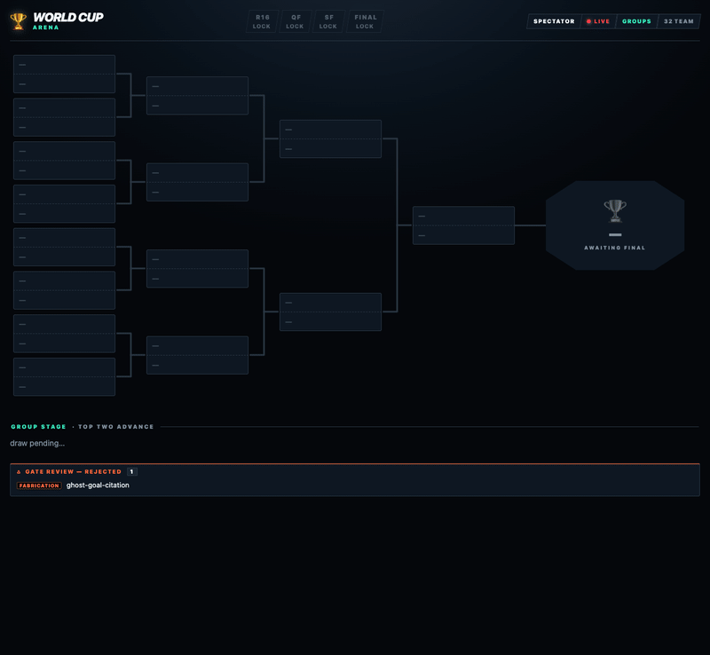

# worldcup

[](https://github.com/pro-vi/worldcup/actions/workflows/ci.yml)
[](LICENSE)
[](package.json)

Give it 32 or 48 candidates you can judge by reading — taglines, names, essay
drafts, even code as text — and `worldcup` runs them through LLM-judged group
and knockout rounds, disqualifies any entry that invents a fact it can't back
up, and returns a self-contained HTML report: the champion, its road to the
title, and a trust verdict that flags a lucky-looking bracket. It's a general
best-of-N selection engine wearing a World Cup bracket, packaged as an agent
skill. You provide the axes that diversify the candidates and the lenses the
judges score on; the fabrication gate and Elo-calibrated seeding come with the
engine.

Honest scope, up front: there is no benchmark showing this picks *better* than
one strong single or listwise judge call — that comparison is future work.
Prose is where it has real mileage; the code path is exercised by tests and one
committed sample, not yet by battle. The release canary means "not obviously
broken," never "certified." It's an independent project, not affiliated with,
endorsed by, or sponsored by FIFA.

## See it in sixty seconds



The bundled demo needs no agents and no API key — it self-plays a tournament
through the real live-view pipeline. (A real run is different: it needs Claude
Code's Workflow tool and hundreds of model calls; see [Requirements](#requirements).)

```bash
git clone https://github.com/pro-vi/worldcup.git
cd worldcup
npm run demo
```

Open the URL it prints. Group tables build, the knockout fills in slot by slot,
a champion gets crowned — and one entry gets red-carded at the fabrication gate
along the way, because that gate is the point.

## Why this shape — and what it hasn't proved

worldcup exists because the naive version failed in a specific way: an early run
let an essay win by fabricating concrete detail — invented line numbers, a fake
stack trace — that read as "authentic" to a single tasteless judge. A bigger
model doesn't fix that; a judging architecture with taste does. So: a
fabrication gate that disqualifies liars outright, adversarial lenses that each
attack one axis, the original fielded as one of the N so the champion has to
beat it on merit, and a global pairwise Elo rating that flags a lucky bracket.

What that buys is **legibility, not a proven-better pick**. Instead of an opaque
"the model liked #17," you get group standings, upsets, the champion's road with
the deciding reason each round, and a trust verdict for when the bracket and the
rating disagree — plus a fabrication veto that is mechanism-validated, not
asserted: each of the release canary's three fabrication cases was disqualified
3-of-3 by real judges (`canary/records/2026-07-v0.1.0.json`). What it does *not*
give you is a measured quality win over one strong judge call. Per
[ADR 0001](docs/adr/0001-single-domain-general-judge.md), with no eval harness
"every alternative judge design is argument, not measurement," and
[ADR 0002](docs/adr/0002-no-judge-certification-canary-floor.md) keeps the canary
a floor, not a certification. A head-to-head against the
single-call baseline is named future work; a dated one-field concordance run
lives in [`evidence/`](evidence/) for anyone who wants the raw numbers.

## What a run produces


- **The HTML report** — a self-contained page: mirror bracket, match-day
  headlines, group tables, the champion's road to the title, the global rating,
  disqualifications, and the trust verdict. Every entry is clickable, with its
  full text and match log.
- **The original as a contestant** — field the current version as one of the N
  (`INCLUDE_BASE`, or a `given` item) and it competes like any entry. "Keep the
  original" is then simply the result that it won or out-rated the field — no
  privileged bar, and no anchor bias from pasting the original into every juror's
  prompt.
- **The trust verdict** — a single-elimination winner can be a lucky draw; the
  report says so and offers a runoff.

Two committed samples, reproduced byte-for-byte by
`node scripts/render-sample-report.js` (`npm run check` fails if they drift) and
viewable live with no clone:

- [**Taglines sample**](https://pro-vi.github.io/worldcup/media/sample-report.html)
  — 32 tagline variants, the prose-shaped case.
- [**Code sample**](https://pro-vi.github.io/worldcup/media/sample-report-code.html)
  — the same machinery on **code**: 32 generated `debounce` implementations, one
  disqualified at the gate for a fabricated benchmark claim.

## Quickstart

It's a skill. You can either paste this repo into your agent and ask it to
install worldcup, or set it up by hand — you'll want the clone either way, since
it runs the demo and holds the Workflow template:

```bash
git clone https://github.com/pro-vi/worldcup.git && cd worldcup   # skip if you ran the demo
mkdir -p ~/.claude/skills
ln -sfn "$(pwd)/worldcup" ~/.claude/skills/worldcup   # symlink stays in sync with git pull
npm run check                                         # confirm the repo is coherent
```

A full tournament drives Claude Code's ultracode Workflow tool; see
[Requirements](#requirements). Restart Claude Code so it reloads skills, then run
`/worldcup` — or just describe the task: "generate 32 tagline variants and pick
the best."

## Requirements

- An agent host that can load skills from `SKILL.md`.
- Node.js 20+ for the demo, the live view, and the repository checks.
- No npm dependencies.

### The Workflow dependency

Real tournament runs need the
**[ultracode Workflow tool](https://code.claude.com/docs/en/workflows)**: a
multi-agent orchestration feature (Claude Code's ultracode mode) that takes a
plain-JavaScript script exposing `agent()` / `parallel()` / `log()` / `phase()`
and runs it as one deterministic background run. It needs Claude Code v2.1.154 or
later on a paid plan — enable it with `/effort ultracode`, or just ask for a
workflow in any prompt. The skill fills that script in from
`worldcup/references/workflow-template.js`. A real 32-team run is hundreds of
judge and generation agent calls; the skill states the ballpark and the tier
before launching.

Without the Workflow tool you still get `npm run demo`, the standalone
fabrication-gated judging doctrine in `worldcup/references/judging.md`, and the
portable template — plain JS with marked fill-in seams, adaptable to any
orchestrator whose `parallel()` returns results in input order (`Promise.all`
semantics; a completion-order pool silently breaks determinism).

<details>
<summary><b>Optional: isolate tournament judges from tools and repo access</b></summary>

Claude Code operators can prevent tournament judges from reading the repository,
running shell commands, or using the web. Copy
`worldcup/references/agents/worldcup-judge.md` to `.claude/agents/worldcup-judge.md`
(project) or `~/.claude/agents/worldcup-judge.md`, start a new Claude session so
the agent registry reloads, and in the copied template set:

```js
EVALUATOR.agentOptions = { ...EVALUATOR.agentOptions, agentType: 'worldcup-judge' }
```

This is judge-only — generation and any fetch/research agent keep their normal
tools. The agent definition uses Claude Code's documented `disallowedTools`
frontmatter, and a schema-bound sentinel runs before generation so a missing
definition or stale session fails the run before it spends calls. The paired host
probe (`worldcup/references/agents/workflow-judge-agent-probe.js`) must show an
unrestricted control using an ordinary tool while the typed judge cannot; prompt
refusal alone does not count. The default stays `{}` for portable orchestrators.
</details>

## The live view

Every run is watchable for free in `/workflows`. On top of that, a
dependency-free HTML bracket fills in *while the run happens* — group tables
building, knockout games playing, the champion crowned with a confetti burst
(three themes; `--serve` for a flicker-free localhost page). Preview it any time
with `npm run demo`; wiring it into a real run is step 4 of `worldcup/SKILL.md`.

## Verify the repo

```bash
npm run check
```

Runs syntax checks, the live-view parser/fold tests, canary validation, and a
deterministic fake-judge harness that plays the entire tournament template with
stub judges (including a completion-order-invariance test: same verdicts,
byte-identical report). CI mirrors it on Linux (Node 20/22/24) and Windows
(Node 20). The six-case judge canary is also run through real judges before each
release and the validated record committed — see [`canary/`](canary/).

## Status

Shipped: flat and factorial/axes generation, section recombination, snake
seeding, 32- and 48-team advancement, the fabrication gate, Elo, the original as
a contestant (`INCLUDE_BASE`), the live view, and the final HTML report — all
kept honest by the fake-judge end-to-end harness. Deferred: genetic evolve mode,
a mixed-radix optimal-design solver, and bundled domain profiles.
